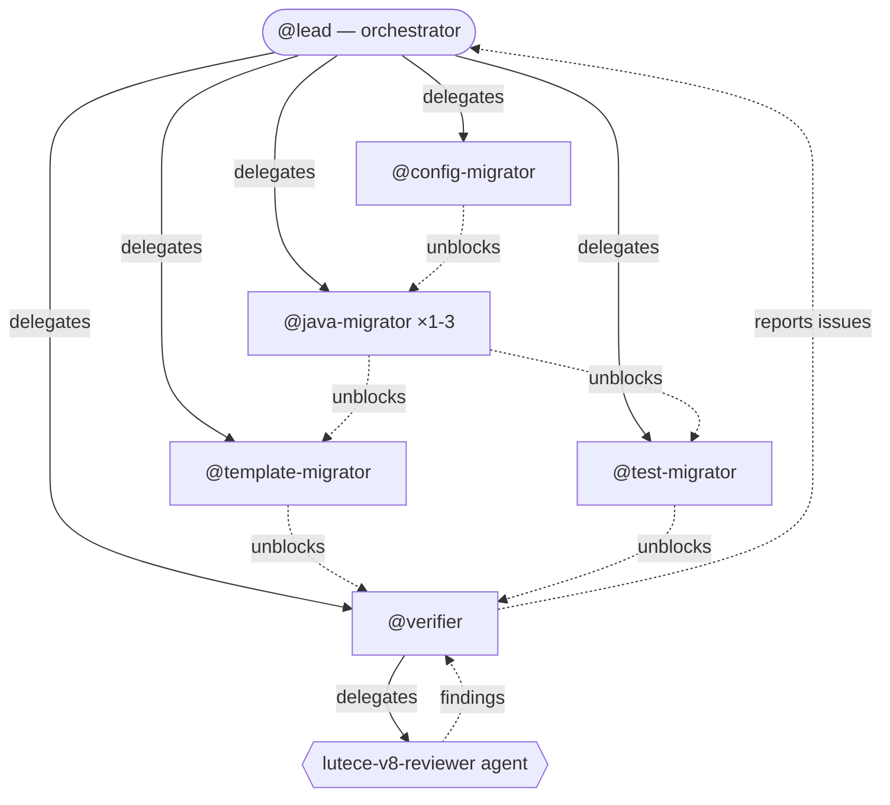
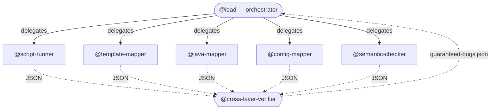

# Lutecepowers

Claude Code plugin for **Lutece 8** framework development.

## Installation

```bash
/plugin marketplace add lutece-platform/lutece-dev-plugin-claude
/plugin install lutecepowers-v8
# install in user scope
```

## What it does

At session start, the plugin automatically:

1. **Clones/updates reference repos** — 30 Lutece v8 repositories into `~/.lutece-references/`
2. **Copies rules** — Detects if the current project is a Lutece plugin and copies coding constraint rules into `.claude/rules/`
3. **Injects context** — Bootstrap message with architecture patterns and available skills

## Skills

| Skill | Description |
|-------|-------------|
| `lutece-patterns` | Architecture reference: layered design, CDI patterns, CRUD lifecycle, pagination, XPages, daemons, security checklist |
| `lutece-migration-v8-agent-teams` | Migration v7 → v8 via **Agent Teams** (Swarm Mode). Parallel teammates, 9 scripts, JSON-driven task decomposition. Requires `export CLAUDE_CODE_EXPERIMENTAL_AGENT_TEAMS=1` |
| `lutece-scalability-v8` | Make a plugin **horizontally scalable** (multi-instance) and **prove it**. Scans 7 scalability axes, fixes via **Agent Teams**, then deploys in a real 3-instance cluster (Liberty + MariaDB + nginx + Hazelcast) and verifies empirically. Run **after** the migration. Requires `export CLAUDE_CODE_EXPERIMENTAL_AGENT_TEAMS=1` + Docker |
| `lutece-dao` | DAO + Home layer patterns: DAOUtil lifecycle, SQL constants, CDI lookup |
| `lutece-workflow` | Workflow module patterns: tasks, CDI producers, components, templates |
| `lutece-rbac` | RBAC: entity permissions, ResourceIdService, plugin.xml, JspBean authorization |
| `lutece-cache` | Cache: AbstractCacheableService, CDI init, invalidation via CDI events |
| `lutece-lucene-indexer` | Plugin-internal Lucene search: custom index, daemon, CDI events |
| `lutece-solr-indexer` | Solr search module: SolrIndexer interface, CDI auto-discovery, batch indexing |
| `lutece-elasticdata` | Elasticsearch DataSource: DataSource/DataObject interfaces, two-daemon indexing |
| `lutece-deep-review` | Deep review via **Agent Teams**. Traces request lifecycle (template → bean → service → DAO → SQL), cross-references layers to find guaranteed bugs. Requires `export CLAUDE_CODE_EXPERIMENTAL_AGENT_TEAMS=1` |
| `lutece-update-template-bo` | Updates a Back Office (admin) template by replacing raw HTML with the FreeMarker macros from lutece-core's Tabler theme |
| `lutece-update-template-fo` | Updates a Front Office (skin) template by replacing raw HTML with the FreeMarker FO macros from lutece-core |

## Agent

| Agent | Model | Description |
|-------|-------|-------------|
| `lutece-v8-reviewer` | Opus | Read-only compliance reviewer. Runs `scan-project.sh` + `verify-migration.sh`, then semantic analysis (CDI scopes, singletons, producers, cache guards), then full build with tests. Produces a structured PASS/WARN/FAIL report. |

## Migration flow (`/lutece-migration-v8-agent-teams`)

**Input:** a Lutece v7 plugin/module/library (Spring, javax, XML context).

**Architecture:** Team Lead orchestrates, specialized teammates execute in parallel. 9 bash scripts handle mechanical work, AI handles intelligent decisions (CDI scopes, producers, events).

| Phase | What | Who |
|-------|------|-----|
| A — Scan | `scan-project.sh` → JSON inventory, dependency v8 check | @lead |
| B — Task Decomposition | `task-splitter.sh` → per-teammate JSON task files | @lead |
| C — Spawn Teammates | @config-migrator, @java-migrator (×1-3), @template-migrator, @test-migrator, @verifier | @lead |
| D — Task Dependencies | @config-migrator → @java-migrator(s) → @template-migrator + @test-migrator → @verifier final build | @lead |
| E — Monitoring | `progress-report.sh`, mailbox messaging, blocker resolution | @lead |
| F — Final Gate | 0 FAIL on `verify-migration.sh`, green build, v8-reviewer agent | @verifier + @lead |



### Teammates

| Teammate | Count | Role |
|----------|-------|------|
| @config-migrator | 1 | POM, beans.xml, context XML → JSON, plugin descriptor, web.xml, SQL Liquibase |
| @java-migrator | 1-3 | `migrate-java-mechanical.sh` then CDI scopes, producers, events, cache, deprecated API |
| @template-migrator | 0-1 | `migrate-template-mechanical.sh` then JSP, admin/skin templates, jQuery→vanilla JS |
| @test-migrator | 0-1 | JUnit 4→5, mock renames, CDI test extensions |
| @verifier | 1 | Continuous `verify-file.sh`, final `verify-migration.sh`, `mvn clean install`, reviewer agent |

### Scripts

| Script | Purpose |
|--------|---------|
| `scan-project.sh` | Full project scan → structured JSON |
| `task-splitter.sh` | JSON scan → per-teammate task files |
| `migrate-java-mechanical.sh` | javax→jakarta + Spring→CDI on file list |
| `migrate-template-mechanical.sh` | BO macros + null-safety + namespace |
| `extract-context-beans.sh` | Spring context XML → JSON catalog |
| `verify-migration.sh` | 70+ checks, optional `--json` mode |
| `verify-file.sh` | Per-file verification subset |
| `add-liquibase-headers.sh` | Liquibase headers on SQL files |
| `progress-report.sh` | Migration progress dashboard |

**Output:** migrated v8 plugin with green build and clean compliance report.

## Deep review flow (`/lutece-deep-review`)

**Input:** any Lutece plugin/module (v8).

**Goal:** Trace the complete request lifecycle across all layers and cross-reference them to find **guaranteed bugs**
**Architecture:** Team Lead orchestrates, 6 specialized teammates (5 parallel + 1 final verifier).

| Phase | What | Who |
|-------|------|-----|
| A — Scan | `scan-project.sh` + `verify-migration.sh` → JSON baseline | @lead |
| B — Spawn | 5 mappers/checkers in parallel | @lead |
| C — Cross-ref | Cross-Layer Verifier merges all JSON, finds disconnects | @cross-layer-verifier |
| D — Report | Structured report: script results + semantic checks + guaranteed bugs | @lead |
| E — Fix (opt.) | Propose fixes for found bugs | @lead |



### Teammates

| Teammate | Role |
|----------|------|
| @script-runner | Runs `scan-project.sh` + `verify-migration.sh`, produces baseline JSON |
| @template-mapper | Extracts template flows: model attributes, form fields, actions, i18n keys |
| @java-mapper | Extracts Java flows: bean methods, service calls, DAO queries, model puts |
| @config-mapper | Extracts config: plugin.xml rights, XPage paths, REST endpoints |
| @semantic-checker | CDI scopes, singletons, producers, cache guards, deprecated API |
| @cross-layer-verifier | Merges all JSONs, cross-references layers, outputs guaranteed bugs only |

**Output:** structured report with guaranteed bugs + optional auto-fix.

## Rules

Rules are short constraints (5-15 lines) automatically loaded when the agent touches matching files.

| Rule | Scope |
|------|-------|
| `java-conventions` | `**/*.java` — Jakarta EE, CDI (not Spring), forbidden libraries, DAOUtil, logging |
| `web-bean` | `**/web/**/*.java` — JspBean/XPage: CDI, CRUD lifecycle, security tokens |
| `service-layer` | `**/service/**/*.java` — CDI scopes, injection, events, cache |
| `dao-patterns` | `**/business/**/*.java` — DAOUtil lifecycle, SQL constants, Home facade |
| `sql-liquibase` | `**/sql/**/*.sql` — Liquibase formatted-sql header, changeset identity, real preconditions |
| `sql-rename` | `**/sql/**/*.sql` + `**/plugins/*.xml` — Renaming SQL dirs/plugins: logicalFilePath on the changeset line |
| `testing` | `**/test/**/*.java` + `pom.xml` — Build/test commands, JUnit 5, test base classes |
| `template-back-office` | `**/templates/admin/**/*.html` — v8 Freemarker macros, BS5/Tabler |
| `template-front-office` | `**/templates/skin/**/*.html` — BS5 classes, vanilla JS, no jQuery |
| `jsp-admin` | `**/*.jsp` — JSP boilerplate, bean naming |
| `plugin-descriptor` | `**/plugins/*.xml` — Mandatory tags, core-version-dependency |
| `messages-properties` | global — i18n key conventions |
| `dependency-references` | global — Auto-fetch Lutece dep sources, v8 branch detection |

## Tests

```bash
pip install -r tests/requirements.txt
python3 -m pytest tests/test.py -v

# Run a specific test
python3 -m pytest tests/test.py -v -k "v8_reviewer"

# Run tests in parallel
python3 -m pytest tests/test.py -v -n 4
```

Latest results: [TEST_REPORT.md](TEST_REPORT.md)

## Local development

```bash
# Test against a Lutece project
cd /path/to/your-lutece-plugin
claude --plugin-dir /path/to/lutecepowers
```
